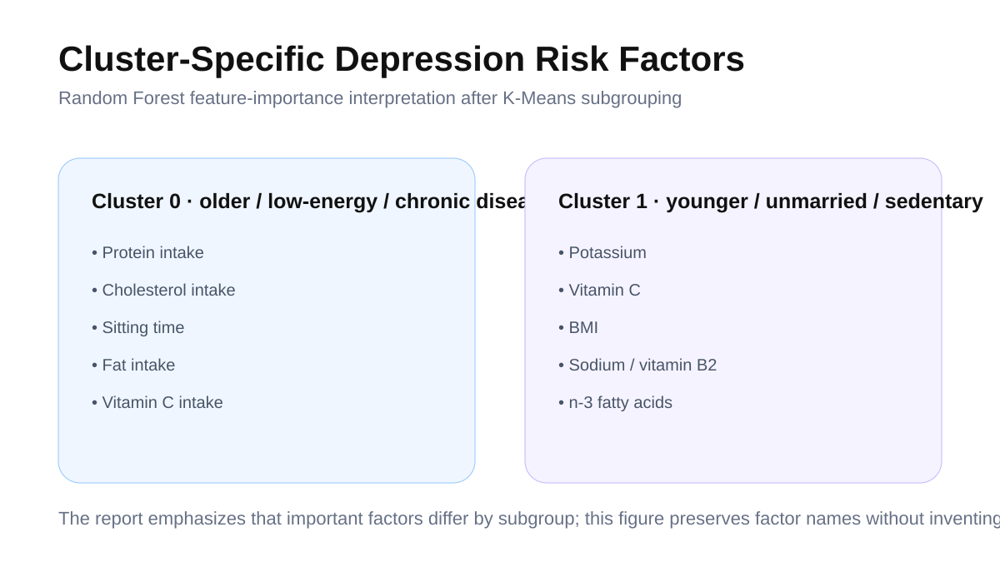
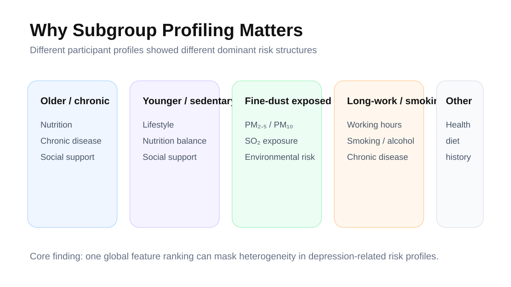
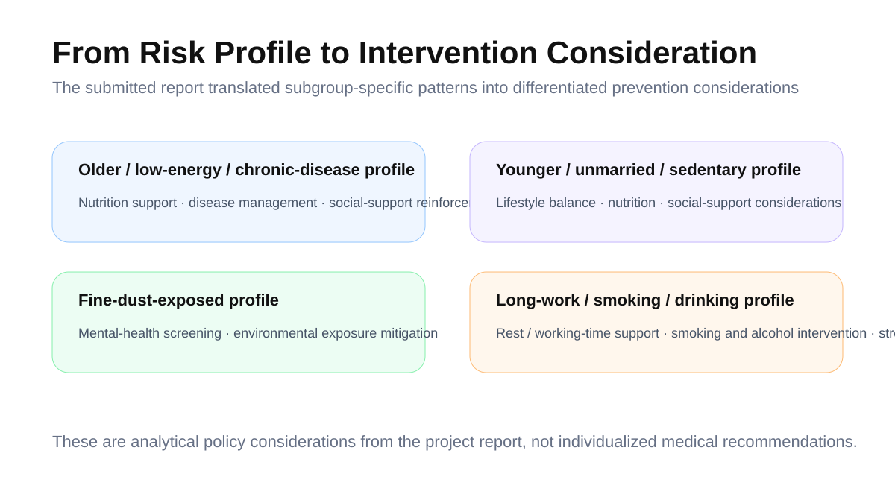

# Depression Risk Prediction Using KNHANES Data

> Subgroup-specific depression-risk profiling using KNHANES health-survey data and linked air-pollution variables.

**Period:** Jun. 2025 - Sep. 2025  
**Core methods:** K-Means · SMOTE · Random Forest  
**Analysis scale:** 14,773 observations · 71 variables  
**Final reported performance:** Average AUC **0.7378**

---

## Overview

This project combined **KNHANES** health-survey records with linked air-pollution data to analyze depression risk across a heterogeneous population.

Rather than assuming that one universal risk structure applies to everyone, the analysis first derived population subgroups and then examined **subgroup-specific depression-risk patterns** with machine learning.

The final workflow connected:

**health + lifestyle + socioeconomic + nutrition + environmental exposure data → subgroup profiling → depression-risk prediction**.

## Data

The submitted analysis used data from **2014, 2016, 2020, and 2022** and combined examination, health-questionnaire, nutrition, and environmental-exposure variables.

After staged validity / missing-data processing and feature reduction, the analysis dataset contained:

- **14,773 observations**
- **71 variables**
- one-hot encoding for categorical variables
- scaling for continuous variables

Raw KNHANES and linked environmental data are not redistributed in this repository.

## Modeling strategy

1. Integrate health, behavioral, socioeconomic, nutritional, chronic-disease, and air-pollution variables.
2. Use **K-Means (K=5)** to derive participant subgroups.
3. Address within-cluster class imbalance using **SMOTE**.
4. Compare candidate classifiers.
5. Use subgroup-specific **Random Forest** models for depression-risk prediction and feature-importance interpretation.
6. Compare risk structures across clusters and translate them into differentiated intervention considerations.

## Main result

The final portfolio version reports an **average AUC of 0.7378** across the subgroup-specific depression-risk modeling pipeline.

The project showed that the most important predictors differed across clusters, supporting the idea that depression-risk structure is **heterogeneous rather than uniform across the population**.

## Subgroup profiling

The five K-Means clusters represented distinct analytical profiles rather than clinical diagnoses. Their characteristics differed across age, chronic disease, lifestyle, nutrition, social context, and environmental exposure.

The key analytical value of the project is therefore not a single global feature ranking, but the identification of **different risk structures across population subgroups**.

## Interpretation

Model outputs were used as a **decision-support framework** for understanding subgroup-specific risk patterns. Because the data are observational and pooled across survey years, individual feature importance should not be interpreted as causal evidence.

## Project provenance

The submitted report lists **Junha Won as representative author**, with Seungju Jung and Seunghyun Park as co-authors. This repository documents the report's data integration, subgroup modeling, feature-importance interpretation, and intervention framing without claiming individual contribution beyond what the source materials support.

## Public outputs

- [`outputs/knhanes-analysis-public-excerpt.pdf`](outputs/knhanes-analysis-public-excerpt.pdf) — concise public-safe technical excerpt derived from the submitted report.
- [`outputs/PROJECT_OUTPUTS.md`](outputs/PROJECT_OUTPUTS.md) — source provenance, verified analysis structure, and public-release notes.

## Limitations

- Observational, cross-sectional / pooled survey design
- No causal interpretation of individual risk factors
- Cluster labels are analytical profiles, not clinical diagnoses
- Environmental exposure linkage may introduce spatial / temporal approximation

---

**Junha Won** · Ajou University  
[Portfolio detail](https://juna0926.github.io/Portfolio/projects/knhanes.html) · [Portfolio](https://juna0926.github.io/Portfolio/) · [GitHub](https://github.com/Juna0926)
